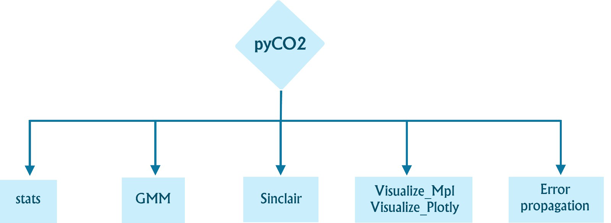

Introduction
------------

PyCO2stats is an open-source Python library designed to perform statistical analysis and modelling of CO2 fluxes and geochemical data analysis.

It integrates classical and modern statistical techniques, including descriptive statistics (mean, standard deviation) and more complex analyses such as Gaussian Mixture Models (GMM), the Sinclair graphical method, robust estimators for log-normal data, and Monte Carlo–based uncertainty propagation. The library is designed for transparency and reproducibility and is usable by both Python experts and new users.

The library includes six main components:

* **GMM** — Gaussian Mixture Models with tools to generate synthetic datasets and apply different analysis approaches.
* **Sinclair** — Graphical partitioning of polymodal datasets into log-normal subpopulations.
* **Propagate_Errors** — Monte Carlo error propagation to quantify uncertainty of fitted GMMs.
* **Stats** — A collection of statistics utilities with emphasis on log-normal distributions.
* **Visualize_MPL** and **Visualize_Plotly** — Statistical visualization via Matplotlib or Plotly.

PyCO2stats is actively maintained. Feature requests and bug reports are welcome via GitHub issues and pull requests.

**GitHub:** `AIVolcanoLab/pyco2stats <https://github.com/AIVolcanoLab/pyco2stats>`_
