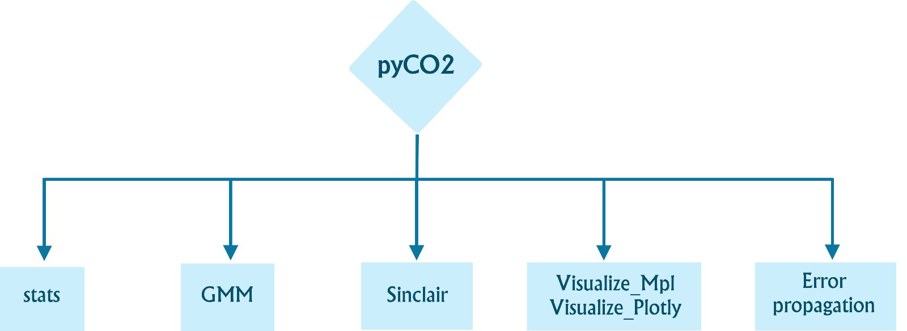

Introduction and Citation
============================

Introduction
----------------------------

Welcome to PyCO2Stats - an open-source Python library designed to perform statistical analysis and modelling of CO2 fluxes and geochemical data analysis.

It integrates classical and modern statistical techniques, including descriptive statistics (mean, standard deviation) and more complex analyses such as Gaussian Mixture Models (GMM), the Sinclair graphical method, robust estimators for log-normal data, and Monte Carlo–based uncertainty propagation. The library is designed for transparency and reproducibility and is usable by both Python experts and new users.

The library includes six main components:

* **GMM** — Gaussian Mixture Models with tools to generate synthetic datasets and apply different analysis approaches.
* **Sinclair** — Graphical partitioning of polymodal datasets into log-normal subpopulations.
* **Propagate_Errors** — Monte Carlo error propagation to quantify uncertainty of fitted GMMs.
* **Stats** — A collection of statistics utilities with emphasis on log-normal distributions.
* **Visualize_MPL** and **Visualize_Plotly** — Statistical visualization via Matplotlib or Plotly.

When can PYCO2stats be your ally?
----------------------------

PyCO2stats is designed for geoscientists working with data across a broad range of applications, from volcanology and geothermal exploration to environmental research. It can be useful when you have a set of measurements (such as carbon, methane or sulfur fluxes from soils, metal abundances in streams and soils, or concentrations of key elements in geothermal exploration) and your data follow a log-normal distribution.
It helps you in the statistical description of your dataset, for example by calculating the mean and variance of the distribution.

But what if your dataset is the result of multiple underlying geological processes?
In that case, pyCO2stats allows you to partition your dataset into x subpopulations and calculate the mean and confidence interval of each one.
In short: give pyCO2stats your data, and let it help you uncover the stories hiding inside it!

PyCO2stats is actively maintained. Feature requests and bug reports are welcome via GitHub issues and pull requests.

**GitHub:** `AIVolcanoLab/pyco2stats <https://github.com/AIVolcanoLab/pyco2stats>`_

Citation
----------------------------

If you use **pyco2stats** in your research, please cite:

Ricci, L., Baroni, M., Ágreda-López, M., Ariano, A., Frondini, F., Saldi, G., Cardellini, C., Perugini, D., Chiodini, G., Petrelli, M.
**PyCO2stats: A Python Library for Statistical Modeling of CO2 Fluxes and Geochemical Population Analysis in Volcanic and Environmental Systems**.
*Journal/venue*, Year, DOI: XXX.

**Link to the paper here**
